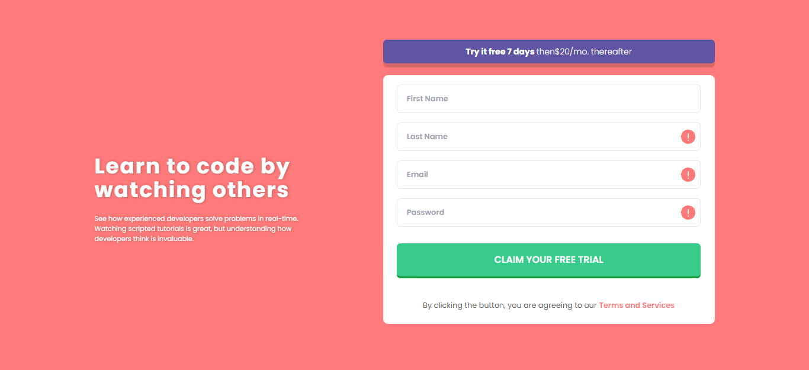
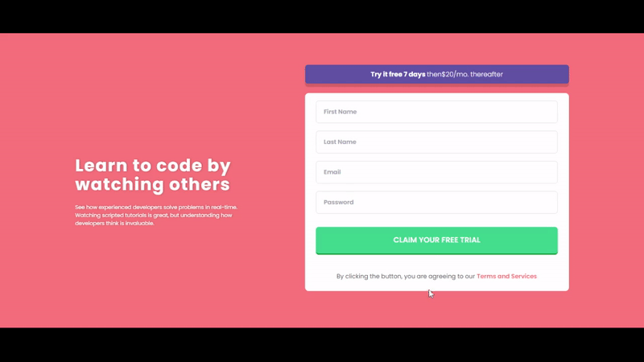

#Validação Formulário

Formulário de cadastro paa período de testes.
Para o projeto foi usado React com vite, para validação do formulário javascrip e estilização TailwindCss .



## Stack utilizada

**Front-end:** React, TailwindCSS

## Demonstração



## Instalação

Instale my-project com npm

```bash
  git clone https://github.com/jonas-nb/ComponentForm
  npm install my-project
  cd my-project
```

## Deploy

Para fazer o deploy desse projeto rode

```bash
  npm vite build
```

## Referência

-   [Design preview for the Interactive Formulário de Validação coding challenge](src/assets/images/app.png/)
-   [Frontend Mentor](https://www.frontendmentor.io) challenges help you improve your coding skills by building realistic projects.

## Autores

-   [@jonas-nb](https://www.github.com/jonas-nb)
